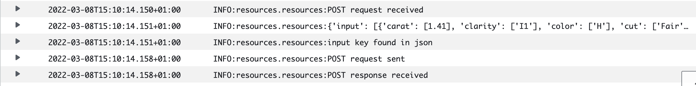

# Diamonds - Continous Batch Training - Serving

## Summary
This repository trains and serves a machine learning model based on this [dataset](https://www.kaggle.com/shivam2503/diamonds).

It consists of three microservices:
- /training - Batch Training Job that can be scheduled or triggered by an event
- /serving - Flask API serving as the backend
- /model - Tensorflow Serving to respond with predictions

All three microservices are deployable on AWS but can alse be run locally.

To deploy your AWS User requires the necessary permissions the deploy the specified resources via CloudFormation.

During training, the batch training container downloads a csv from a S3 bucket, and checks whether it can download and instantiate a trained model from the same S3 bucket. If it cannot find a trained model it trains a new one on the csv data.
After training it stores the model once without its optimizer, for serving, and once with its optimizer weights such that it can continue training on a new dataset. 

During serving a flask api sits behind a public load balancer and sends correctly formated incoming diamond price post requests to the Tensorflow Serving model, sitting behind a private load balancer, and returns its resoponse to the client.

## Demonstration
AWS


Local


## Requirements

    Local:
    - docker with docker-compose
    - make utility

    Additionally for AWS deployment:
    - AWS account
    - AWS CloudFormation

## Deployment Commands

#### Building the containers
```
# local use
make up-local-train
make up-local-serve
make tests

# aws use
make up-aws-train
make up-aws-serve
```

The Cloudformation definitions require the built images to be pullable on the specified Elastic Container Registry.
Here are example [push commands](https://docs.aws.amazon.com/AmazonECR/latest/userguide/docker-push-ecr-image.html).

#### Creating AWS VPC and Subnets
All aws resources are deployed on a newly created VPC.
THe VPC consists of 2 private subnets and 2 public subnets.

The 2 public subnets host a public load balancer and a NAT Gateway
The 2 private subnets host the tensorflow serving service, the api service, and a private load balancer.
The batch training's subnet can be chosen during execution definition.

```
make create-vpc
```

#### Creating ECS-Cluster
An ECS cluster is a logical grouping of tasks or services. Tasks and services are run on infrastructure that is registered to a cluster.

- Services run all the time - Flask API & Tensorflow Serving
- Tasks can be schedlued or triggered - Batch Training

```
make create-ecscluster
```

#### Load Balancers
The public/external LB distributed traffic to all containers running the flask api, while the private/internal LB does the same for the Tensorflow Serving containers.

```
make create-alb-public
make create-alb-private
```

#### Creating Tasks and Services
The make commands of the two services will immediately deploy the two services and make them callable via the public LB's address.

The batch training task can be scheduled, e.g. as cron job, or  triggered by a CloudWatch or Eventbridge event.
An example will be given below.

```
make create-api-service
make create-tf-service

make create-train-task
```

#### Sending requests
These requests contain two diamand prediction requests.
```
# local
make post-local-api

# aws
make post-aws-api
```

## Information on Tasks and Services and possible Improvements

#### Batch Training

I read the original kaggle csv into memory, shuffled it, split it row-wise in half, and finally saved both as csv with names diamonds1.csv, and diamonds2.csv, respectively.
Both csv are also located in the same S3 bucket as model and model weights.
[diamonds1.csv](https://diamonds-ml-project.s3.us-east-2.amazonaws.com/diamonds1.csv)
[diamonds2.csv](https://diamonds-ml-project.s3.us-east-2.amazonaws.com/diamonds2.csv)

At first, I trained the model on diamonds1.csv, and currently every further triggering of the training will be done on diamonds2.csv, simulating new data coming in.
Every new training will be continue on the same weights and optimizer variables as the last one, until the model.zip in the S3 bucket is deleted.

Task needs a Task role that allows it to interact with the S3 bucket.

Validation accuracy is logged to CloudWatch and can be used to compare model evolution.

##### Improvements

- Normally, the training would be put into the package. However, this repository focuses more on the deployment-side. The package dia_train can be used for that in the future.
- Passing arguments to the container run, e.g. csv-file name, number of epochs, etc.
- Define triggering as api call, either imperatively or declaratively

##### Example pictures
The batch training container can be triggered given its use case.
Below I will demonstrate how to run it as a scheduled job.
A fitting alternative would be to trigger it once a new training csv is uploaded.
However, AWS is currently migrating this functionality from CloudWatch Events to Eventbridge, hence it was not easily available.

Schedule job via console


Example logs


#### Flask API

The Flask API is used to check correctness of the post requests such that it can be correctly sent to Tensorflow Serving.

Some exmaple test cases are also provided.

##### Improvements
- Write more tests
- Add functionality to interact with e.g. a NOSQL db
- Write it in a framework or language that is more suited for microservices, e.g. Golang

Example logs


#### Tensorflow Serving

Receives data to predict and serves predictions.

Example logs

